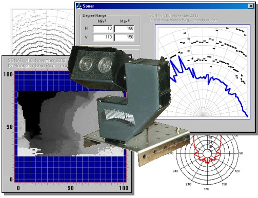

<html>

<head>
<meta http-equiv="Content-Language" content="es">
<meta http-equiv="Content-Type" content="text/html; charset=windows-1252">
<meta name="GENERATOR" content="Microsoft FrontPage 4.0">
<meta name="ProgId" content="FrontPage.Editor.Document">
</head>

<blockquote>
  <blockquote>
    <blockquote>

<table border="0" width="73%">
  <tr>
    <td width="109%"><b><i>Dise�o y aplicaci�n de un Sonar de
      barrido.&nbsp;</i></b>
      
Por Alejandro Alonso Puig 
      Diciembre 2.003 
      

    </td>
    <td width="1%">
      
&nbsp;
      
&nbsp;</td>
  </tr>
</table>

 
El siguiente informe t�cnico describe el dise�o de un sonar de barrido y su
aplicaci�n para generar planos polares y de profundidad

El objetivo de este trabajo ha sido mostrar de una forma
sencilla y gr�fica el modo en que se percibe el entorno mediante
emisores-receptores de ultrasonidos.

Se har� menci�n a todos los aspectos
Hardware y Software, as� como conclusiones de la experiencia.

El trabajo desarrollado no pretende m�s que ser una
introducci�n al manejo de las mediciones ultras�nicas de distancia.

Las medidas tomadas y los mapas mostrados son simples, esto
es, sin tratamientos avanzados de la se�al para aumentar la precisi�n de los
mismos.

